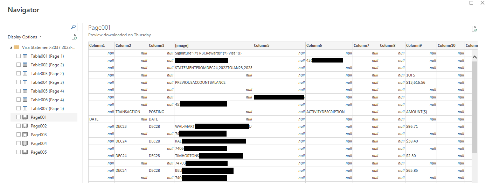
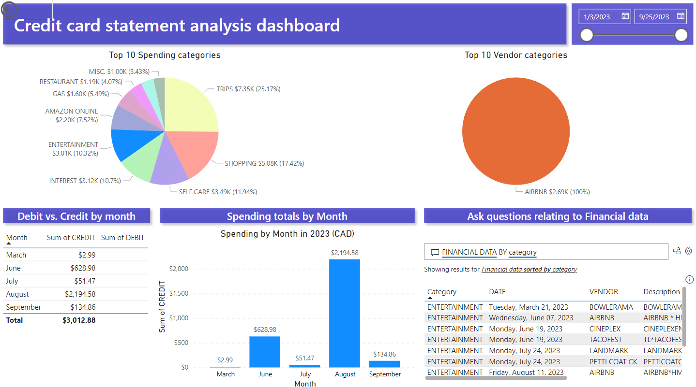

# Credit-card spending habits analysis dashboard
Credit card statement dashboard with Power BI &amp; Excel


### INTRODUCTION
This dashboard was created using PowerBI / PowerQuery for the purpose of analyzing financial data from credit card statements and visualizing debit and credit transactions. This analysis will provide insight on spending habits based on data to help clients make data driven decisions for short-term and long term financial goals. 

### PROBLEM STATEMENT
Using the financial statements: 
1. Identify the main spending categories
2. What vendors are most frequently transacted?
3. What dates are spending habits highest or lowest? Include totals (DR, CR).

### SKILLS / CONCEPTS DEMONSTRATED

#### Data Manipulation / Data modelling
- Power Query, MS Excel
- Importing data (from PDFs), cleaning data, data types, removing outliers, data validation, missing values
- Column manipulation: creating columns using keywords, separating values (e.g. dr, cr)

#### Data Visualization
- Power BI dashboard using: interactive graphs, charts, tables, Q&A, formats, data filters, etc.

#### Statistics
- Monthly breakdown, average, sums

### THE DATA
- This data was obtained from credit card statement PDF files - downloaded from the online banking web app.

#### Data manipulation & Data Structuring
Preparing the data for the dashboard includes:
- importing the data from credit card statements, merging queries
- changing data types
- data cleaning using MS Excel and Power Query (e.g. deleting null values, filling in missing data, merging columns, filtering unrelated data, etc.)
- creating categories [VENDOR, CATEGORY] based on keywords within transaction descriptions
- Separating positives and negatives from the initial Amount [DEBIT, CREDIT]

#### Data from import: 


In the above screenshot the data after PDF import had multiple columns with dates, transactions and amounts. Additionally there were many null values, unrelated analysis values and sentences within the cells from the statements. In the navigator the tables were not formatted properly. The decision was made to use the pages (Page001-Page005) and then merge the queries. 

#### Data after manipulation and structuring:


In the above screenshot the queries were merged. The null values and unrelated data is cleared. The columns were minimized to Date, Transaction and Amount. I created an additional table on the right which allowed keyword search to build the Vendor and Category columns. The debit and credit columns were created from amount. 

The commands used in Excel:

To separate debits:
``` excel
=IF(G2>0,G2,"")
```

To separate credits:
``` excel
=IF(G3<0,G3,"")
```

To distinguish transactions using the keyword table and build the vendor (and category) column:

``` excel
=LOOKUP(9E+99+307,SEARCH($K$4:$K$127,D2),$L$4:$L$127)
```

### VISUALIZATION
The main techniques used to visualize are:
1. Graphs
2. Pie charts
3. Tables
4. Interactive Q&A

Below are the corresponding visualizations for the problem statements:

1. Identify the main spending categories
2. What vendors are most frequently transacted?
3. What dates are spending habits highest or lowest? Include totals (DR, CR).

#### Main Dashboard


The top spending categories are visualized in the graph on the top left. The top vendors are displayed on the top right. The debit and credit figures are displayed with the table on the bottom right, and visualized on the bottom center. Additionally on the top left users are able to filter the data by date using the slider bar. 

#### Interactive categories 




When a category is selected in the Top Spending categories chart (e.g. shopping), the visuals are displayed on the other graphs and charts as well. This also works for the Top Vendor categories chart.

#### Interactive Monthly breakdown for Debits and Credits


Spending totals can also be analyzed by selecting the month on the Debit vs. Credit by month table, or the Spending totals by Month bar graph.

#### Interactive Q&A 


Users are able to ask questing relating to the table: Financial data. This can be filtered using Month, Debit, Credit, Vendor, Amount, and Description. 

### STATISTICAL ANALYSIS

The interactive Q&A allows averages and sums to be computed. The visualization of the data allows for easier analysis based on specific filters.

### CONCLUSION

In conclusion, the data has been visualized in an interactive user friendly format. The problem statement has been addressed.
The main spending categories are visualized using pie charts, along with the most frequently transacted vendors. Spending habits are displayed and can be navigated by date to view the Debit and credit values.

Therefore, users can gain insight on spending habits based on data to make data driven decisions for short-term and long term financial goals. 

#### Thank you for reading!
